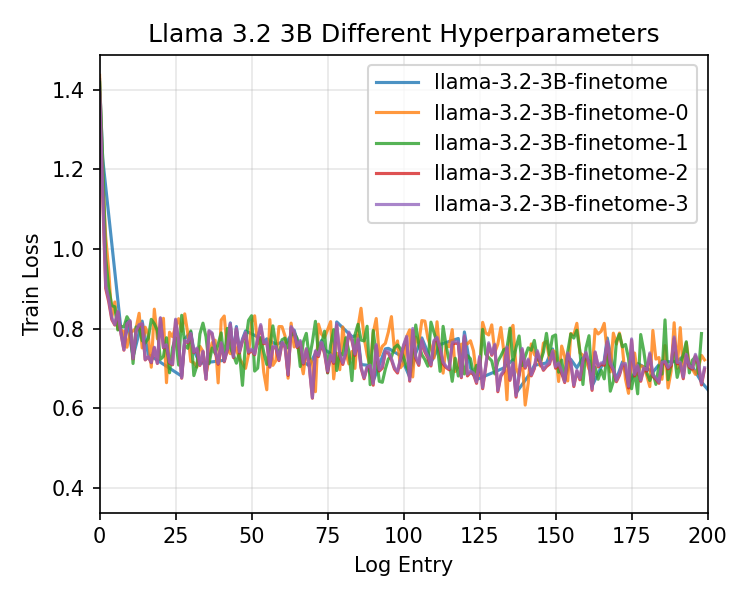
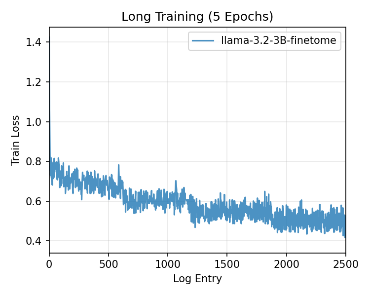
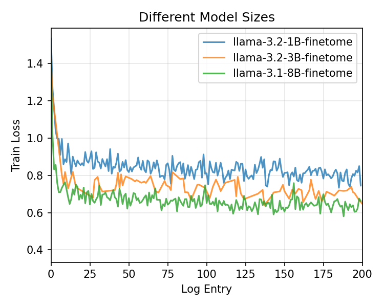
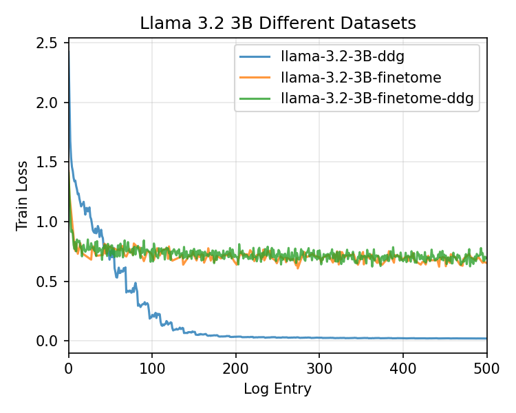

# Llama 3 PEFT


This repo contains a parameter efficient finetuning pipeline for Llama 3 on Modal. The goal is to understand fine-tuning on limited GPU resources.

Built on top of the [Modal Labs LLM Finetuning guide](https://github.com/modal-labs/llm-finetuning).

## Setup

### Local Development

1. Copy `.env.example` to `.env` and fill in `HF_TOKEN` and `WANDB_API_KEY`.
2. Install dependencies: `uv sync`

### Modal Setup

1. Authenticate with Modal: `modal token new`
2. Create secrets:
```bash
modal secret create my-huggingface-secret HF_TOKEN=...
modal secret create wandb WANDB_API_KEY=...
```

## Usage

### Training

Run training on Modal with a config file:
```bash
modal run src.train --config config/llama-3.2-3B-finetome.yml
```

Resume from a checkpoint:
```bash
modal run src.train --config config/llama-3.2-3B-finetome.yml --resume-from-checkpoint /outputs/llama-3.2-3B-finetome/checkpoint-5000
```

### Serving

Update the configuration in `src/serve.py` with your adapter, then deploy:
```python
BASE_MODEL = "meta-llama/Llama-3.2-3B-Instruct"
LORA_ADAPTER = "maxdcmn/llama-3.2-finetome-ddg-tool"  # Your trained adapter
GPU = "L40S:1"
```

```bash
modal deploy src/serve.py
```

Start the Gradio interface locally: `python app.py`


## Trained Models

| Model | Base | Dataset | HuggingFace |
|-------|------|---------|-------------|
| FineTome | Llama-3.2-3B-Instruct | FineTome-100k | `maxdcmn/llama-3.2-3B-finetome` |
| DDG | Llama-3.2-3B-Instruct | ddg-search.jsonl | `maxdcmn/llama-3.2-3B-ddg` |
| FineTome+DDG | Llama-3.2-3B-Instruct | Combined | `maxdcmn/llama-3.2-finetome-ddg-tool` |


## Project Structure

```
llama3-peft/
├── app.py                              # Gradio chat interface
├── config/                             # Training configurations
│   ├── llama-3.2-3B-finetome.yml
│   ├── llama-3.1-8B-finetome.yml
│   └── ...
├── data/
│   └── ddg-search.jsonl                # DuckDuckGo tool-calling dataset
├── logs/
│   ├── csv/                            # Training metrics from W&B
│   └── plots/                          # Generated loss curves
├── notebooks/
│   └── 01_finetune.ipynb               # Unsloth finetuning notebook
├── scripts/
│   ├── 01_generate_ddg_examples.py     # Generate tool-calling data
│   ├── 02_combine_ddg_finetome.py      # Combine datasets
│   ├── 03_get_wandb_logs.py            # Download W&B logs
│   └── 04_plot_wandb_logs.py           # Plot training curves
└── src/
    ├── train.py                        # Training logic (Modal)
    └── serve.py                        # Model serving (Modal + vLLM)
```

## Improving Model Performance

### (a) Model-Centric Approach

#### Training Framework Comparison

`src/train.py` runs on Modal with 2x A100s. Tested Llama 3.2 1B, 3B, and Llama 3.1 8B. The 3B model reached ~0.7 loss after about 2 hours. A full train 

`notebooks/01_finetune-baseline.ipynb` uses Unsloth on a B200. Trained `unsloth/Llama-3.2-3B-Instruct` with rank 64 + RSLoRA, batch size 128, and packing. Reached ~0.64 loss in 44 minutes.

The Modal setup is designed for testing different model sizes, hyperparameters, datasets with proper logging and checkpointing. The Unsloth notebook is optimized for fast single runs (better hardware with a B200, 178GB VRAM). Both use full bf16 precision.

#### LoRA Hyperparameters

| Parameter | Tested | Notes |
|-----------|--------|-------|
| `lora_r` | 16, 32 | Rank determines how many parameters the adapter has. Higher rank can learn more complex patterns but adds more trainable weights. No improvement between 16 and 32 in Modal runs. |
| `lora_alpha` | 32, 64 | Controls how strongly LoRA updates affect the model. The actual scaling is alpha/rank. Too high can destabilize training; ratio of 2 is a safe default. |
| `lora_dropout` | 0.05, 0.15 | LoRA already regularizes by only training a tiny percentage of total params. Adding more dropout didn't improve results. |
| `lora_targets` | all linear | Specifies which weight matrices get LoRA adapters. Targeting all results in maximum flexibility. |

[Hu et al. (2021) LoRA: Low-Rank Adaptation of Large Language Models](https://arxiv.org/abs/2106.09685)

#### Training Hyperparameters

| Parameter | Tested | Observation |
|-----------|--------|-------------|
| `learning_rate` | 2e-4, 3e-4 | Both converged to similar final loss in short runs. 2e-4 is a stable default. |
| `lr_scheduler` | linear, cosine | No significant difference in final loss between schedulers. |
| `warmup_steps` | 50 | 50 steps (~2.5% of 2000) works well for stability. |
| `batch_size` | 1, 2 | Per-device batch size. Batch 2 requires gradient checkpointing on 40GB GPUs. |
| `gradient_accumulation` | 4, 6, 8 | Accumulates gradients over N steps before updating. |
| `sequence_len` | 2048, 4096 | No noticeable improvement with 4096. 2048 is sufficient for FineTome. |
| `gradient_checkpointing` | true/false | Recomputes activations during backward pass. Slower but reduces memory usage. |

#### Model Size

| Model | Final Loss | Observation |
|-------|------------|-------------|
| Llama 3.2 1B | ~0.8 | Noisier convergence, limited capacity. |
| Llama 3.2 3B | ~0.7 | Good quality/cost tradeoff. |
| Llama 3.1 8B | ~0.6 | Best quality, but more compute. |

---

### (b) Data-Centric Approach

#### Datasets

| Dataset | Size | Purpose |
|---------|------|---------|
| [FineTome-100k](https://huggingface.co/datasets/mlabonne/FineTome-100k) | 100k | General instruction-following |
| DDG Search (custom) | 2,200 | DuckDuckGo tool-calling examples |

We tested three data configurations. Training on FineTome only gave stable convergence at around ~0.5 after 5 epochs (25000 steps). Training on the custom DDG dataset caused the loss to drop to ~0.02, a sign of overfitting. Combining both datasets kept loss at ~0.7 while still teaching tool-calling behavior.

<p align="center">
  
  
</p>
<p align="center">
  
  
</p>
