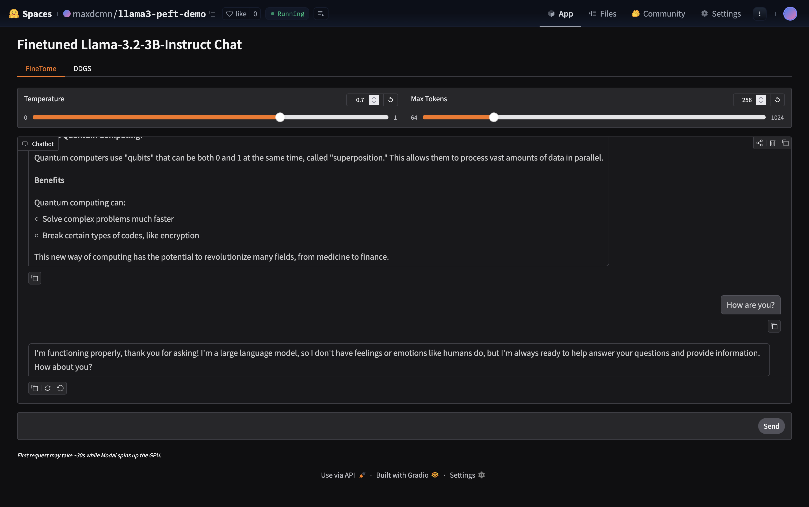
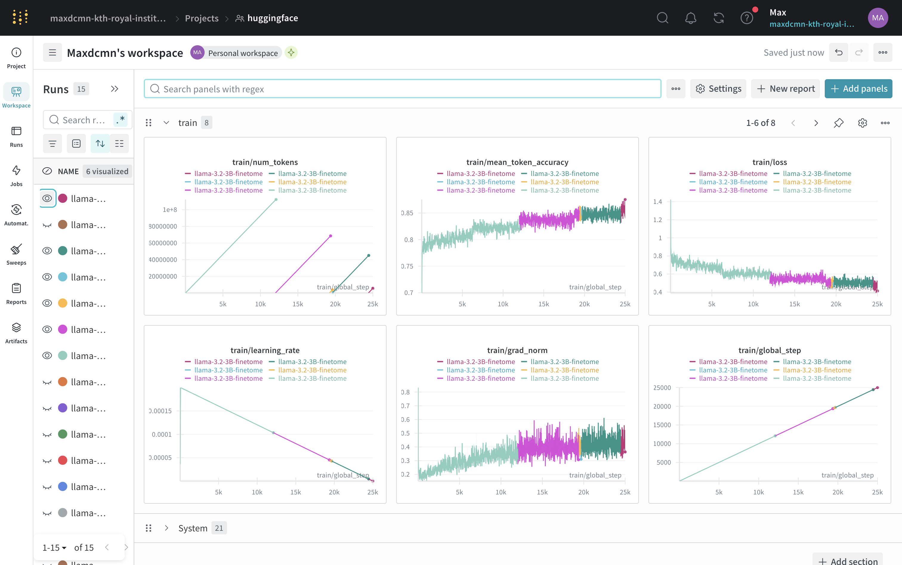
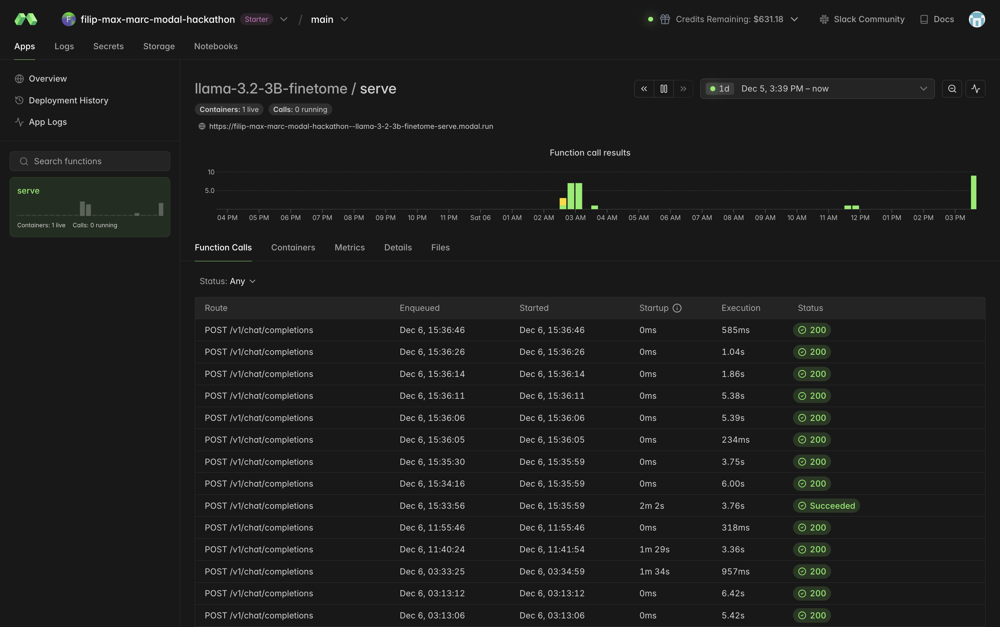

# Llama 3 Parameter Efficient Finetuning


This repo contains a parameter efficient finetuning pipeline for Llama 3 on Modal. The goal is to understand fine-tuning on limited GPU resources.

Built using the [Modal Labs LLM Finetuning guide](https://github.com/modal-labs/llm-finetuning), [Modal Unsloth finetuning example](https://modal.com/docs/examples/unsloth_finetune), and [HuggingFace SFT guide](https://huggingface.co/blog/mlabonne/sft-llama3).



## Setup

### Local Development

1. Copy `.env.example` to `.env` and fill in `HF_TOKEN` and `WANDB_API_KEY`.
2. Install dependencies: `uv sync`

### Modal Setup

1. Authenticate with Modal: `modal token new`
2. Create secrets:
```bash
modal secret create my-huggingface-secret HF_TOKEN=...
modal secret create wandb WANDB_API_KEY=...
```

## Usage

### Training

Run training on Modal with a config file:
```bash
modal run src.train --config config/llama-3.2-3B-finetome.yml
```

Resume from a checkpoint:
```bash
modal run src.train --config config/llama-3.2-3B-finetome.yml --resume-from-checkpoint /outputs/llama-3.2-3B-finetome/checkpoint-5000
```

### Serving

Update the configuration in `src/serve.py` with your adapter, then deploy:
```python
BASE_MODEL = "meta-llama/Llama-3.2-3B-Instruct"
LORA_ADAPTER = "maxdcmn/llama-3.2-finetome-ddg-tool" # Your trained adapter
GPU = "L40S:1"
```

```bash
modal deploy src/serve.py
```

Update the model URLs in `app.py` to point to your deployed Modal endpoints, then start the Gradio interface: `python app.py`


## Trained Models

| Model | Base | Dataset | HuggingFace |
|-------|------|---------|-------------|
| FineTome | Llama-3.2-3B-Instruct | FineTome-100k | `maxdcmn/llama-3.2-3B-finetome` |
| DDG | Llama-3.2-3B-Instruct | ddg-search.jsonl | `maxdcmn/llama-3.2-3B-ddg` |
| FineTome+DDG | Llama-3.2-3B-Instruct | Combined | `maxdcmn/llama-3.2-finetome-ddg-tool` |


## Project Structure

```
llama3-peft/
├── app.py                              # Gradio chat interface
├── config/                             # Training configurations
│   ├── llama-3.2-3B-finetome.yml
│   ├── llama-3.1-8B-finetome.yml
│   └── ...
├── data/
│   └── ddg-search.jsonl                # DuckDuckGo tool-calling dataset
├── logs/
│   ├── csv/                            # Training metrics from W&B
│   └── plots/                          # Generated loss curves
├── notebooks/
│   └── 01_finetune.ipynb               # Unsloth finetuning notebook
├── scripts/
│   ├── 01_generate_ddg_examples.py     # Generate tool-calling data
│   ├── 02_combine_ddg_finetome.py      # Combine datasets
│   ├── 03_get_wandb_logs.py            # Download W&B logs
│   └── 04_plot_wandb_logs.py           # Plot training curves
└── src/
    ├── train.py                        # Training logic (Modal)
    └── serve.py                        # Model serving (Modal + vLLM)
```

## Improving Model Performance

### (a) Model-Centric Approach

#### Training Framework Comparison

`src/train.py` runs on Modal with 2x A100s. Tested Llama 3.2 1B, 3B, and Llama 3.1 8B. Short runs (2000 steps) showed 1B at ~0.8 loss, 3B at ~0.7, and 8B at ~0.6; clear scaling benefit. A full 5-epoch run (25000 steps) on the 3B model reached ~0.5 loss, showing further improvements with longer training.

`notebooks/01_finetune-baseline.ipynb` uses Unsloth on a B200. Trained `unsloth/Llama-3.2-3B-Instruct` with rank 64 + RSLoRA, batch size 128, and packing. Reached ~0.64 loss in 44 minutes.

The Modal setup is designed for testing different model sizes, hyperparameters, datasets with proper logging and checkpointing. The Unsloth notebook is optimized for fast single runs (better hardware with a B200, 178GB VRAM). Both use full bf16 precision.

#### LoRA Hyperparameters

| Parameter | Tested | Notes |
|-----------|--------|-------|
| `lora_r` | 16, 32 | Rank determines how many parameters the adapter has. Higher rank can learn more complex patterns but adds more trainable weights. No improvement between 16 and 32 in Modal runs. |
| `lora_alpha` | 32, 64 | Controls how strongly LoRA updates affect the model. The actual scaling is alpha/rank. Too high can destabilize training; ratio of 2 is a safe default. |
| `lora_dropout` | 0.05, 0.15 | LoRA already regularizes by only training a tiny percentage of total params. Adding more dropout didn't improve results. |
| `lora_targets` | all linear | Specifies which weight matrices get LoRA adapters. Targeting all results in maximum flexibility. |

[Hu et al. (2021) LoRA: Low-Rank Adaptation of Large Language Models](https://arxiv.org/abs/2106.09685)

#### Training Hyperparameters

| Parameter | Tested | Notes |
|-----------|--------|-------------|
| `learning_rate` | 2e-4, 3e-4 | Tested in short runs and ended up at similar loss (~0.7). |
| `lr_scheduler` | linear, cosine | Tested cosine vs linear, loss curves looked almost identical. Doesn't seem to influence much. |
| `warmup_steps` | 50 | Used 50 steps (~2.5% of 2000) to ramp up the learning rate gradually. No divergence issues. |
| `batch_size` | 1, 2 | Batch size 2 needs gradient checkpointing on 40GB GPUs. Batch 1 works but is slower. |
| `gradient_accumulation` | 4, 6, 8 | All configurations resulted in similar results. Allows for larger effective batches because it accumulates gradients over N steps before updating. |
| `sequence_len` | 2048, 4096 | Doubled to 4096 to see if longer context helps. Loss didn't improve, so 2048 is enough for this dataset. |
| `gradient_checkpointing` | true/false | Enables larger batch sizes by trading compute for memory. Makes training slower because it recomputes activations during backward pass. |

We used full bf16 precision for all experiments. Additional optimizations we didn't test include quantization (4-bit/8-bit QLoRA) and 8-bit optimizers (`adamw_8bit`) for example.

---

### (b) Data-Centric Approach

#### Datasets

| Dataset | Size | Purpose |
|---------|------|---------|
| [FineTome-100k](https://huggingface.co/datasets/mlabonne/FineTome-100k) | 100k | General instruction-following |
| DDG Search (custom) | 2,200 | Generated DuckDuckGo tool-calling examples with summarization |

We tested three data configurations. Training on FineTome gave stable convergence at around ~0.5 after 5 epochs (25000 steps). Training on the custom DDG dataset caused the loss to drop to ~0.02, a sign of overfitting. Combining both datasets kept loss at ~0.7 while still teaching tool-calling behavior.

For better evaluation, we could split datasets into train/eval/test sets to assess generalization. FineTome could also be trimmed to a subset to allow for multiple epoch runs.

<p align="center">
  
  
</p>
<p align="center">
  
  
</p>



